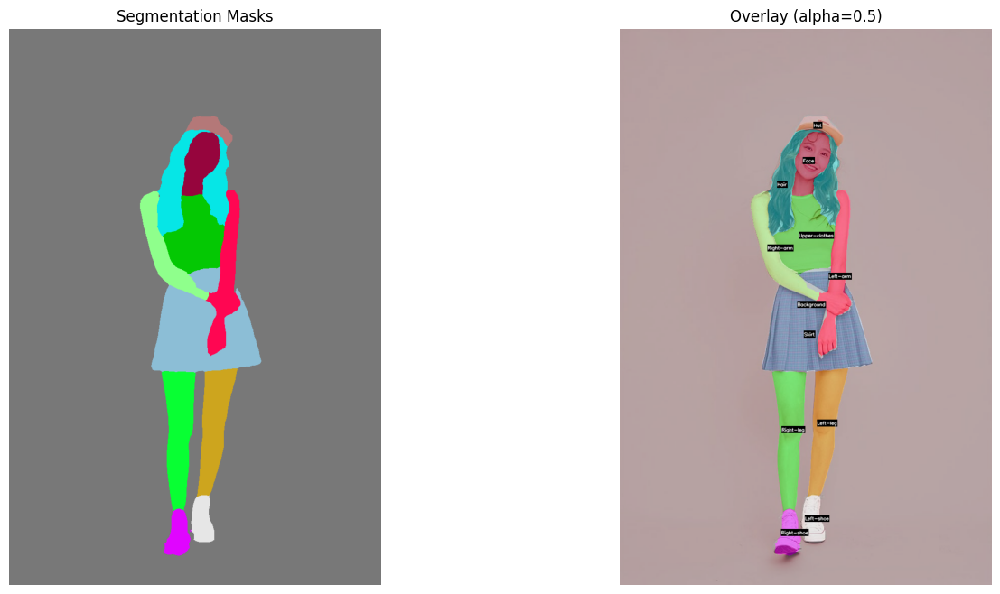
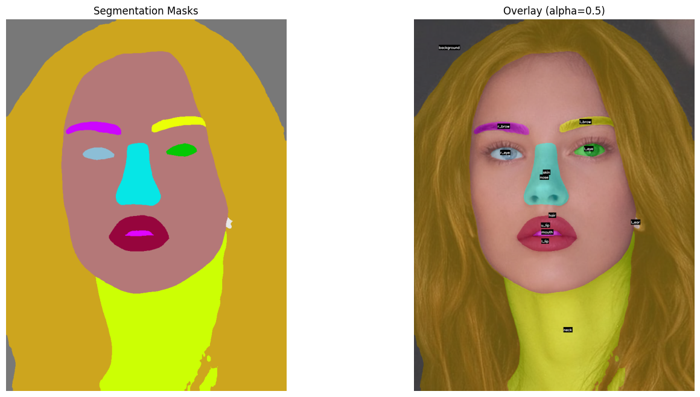

    <h1>Semantic Segmentation using SegFormer   in Hugging Face </h1>

 

---

## 🏗️ Methodology

- 🎨 Semantic Segmentation Model1: **mattmdjaga/segformer_b2_clothes**
- 🎨 App: **Human parsing**
- 🎨 Semantic Segmentation Model2: **jonathandinu/face-parsing**
- 🎨 App: **Face parsing**
- 🎨 Framework: **PyTorch + Hugging Face**

---

## ⭐ Acknowledgements

- SegFormer powered by `Hugging Face`

---
